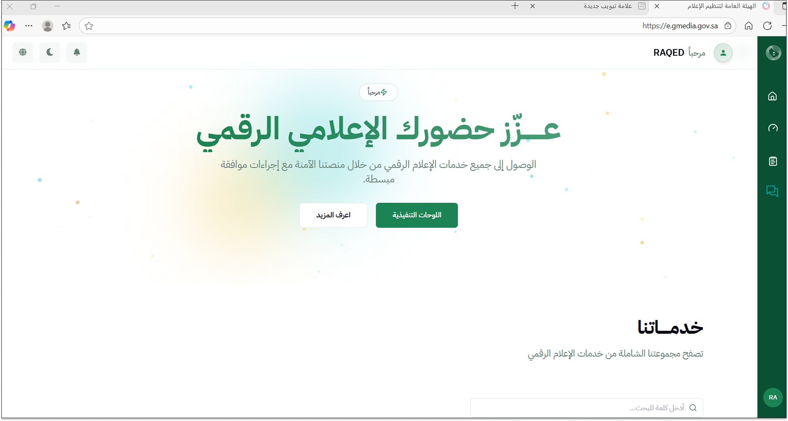

# Chatbot UI Design

UI design project created using Figma for a government entity website.
The design focuses on providing a clear, user-friendly, and accessible chatbot
interface to support beneficiaries and improve digital service delivery.

#Screenshots
1- Chatbot Home Screen

The main chatbot entry point on the government entity website, designed to provide
a clear and welcoming starting interface for beneficiaries.

2- Welcome Interface

The initial welcome interface that introduces the chatbot’s role and guides users
on how to start the conversation.

3- Welcome Message

A friendly welcome message that sets user expectations and enhances user engagement
through clear and simple language.

4- Question Presentation

The chatbot presenting user questions in a structured and readable format to ensure
ease of interaction and clarity.

5- Complete Conversation Flow

A full view of the chatbot conversation flow, demonstrating how the chatbot supports
users from the initial query to the final response.

#Figma Link
[https://www.figma.com/file/XXXX ](https://www.figma.com/design/xNb0TNH7O3K2CgMer70sax/Untitled?node-id=58-122&t=dUOSVzKJVzJizvOj-1)
